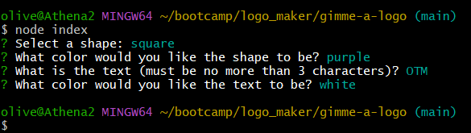
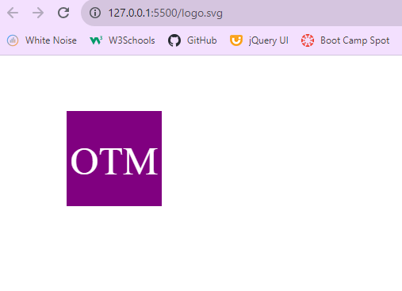

  
  # Gimme A Logo

  ## Table of Contents
  * [Description](#description)
  * [Installation](#installation)
  * [Usage](#usage)
  * [Tests](#tests)
  * [Contributors](#contributors)
  * [Questions](#questions)
  * [License](#license)

  ## Description
  This is a simple SVG logo generator.

  
  

  ## Installation
  Run npm i inquirer and npm i jest and then run node index.

  ## Usage
  Once you run node index, a list of prompts will populate in the terminal. Answer those prompts with your preferences then open the logo.svg file in a live server to view your generated SVG logo.

  ## Tests
  In the terminal run npm run test to run the provided Jest tests

  ## Contributors
  Ollie Terry, TA Kayvon Kazemini

  ## Questions
  If you have any questions please don't hesitate to reach me via email at oliverwills0227@gmail.com

  ## License 
    This project is licensed with MIT

